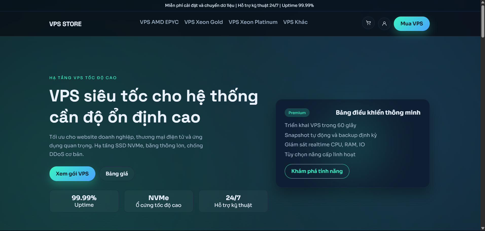
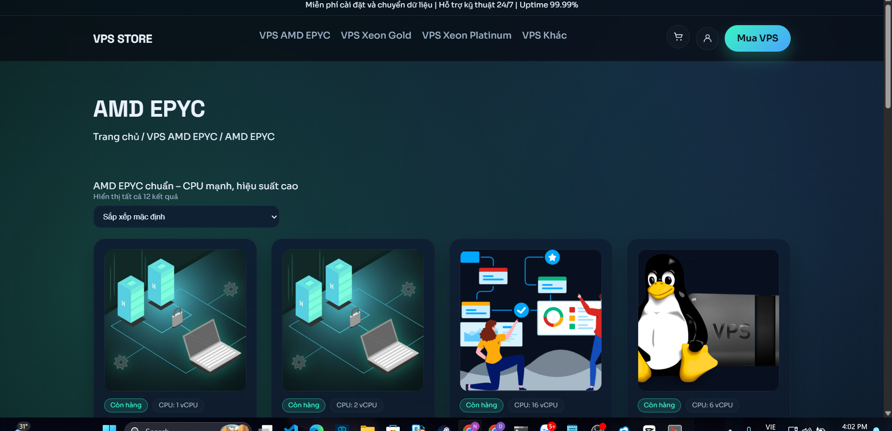
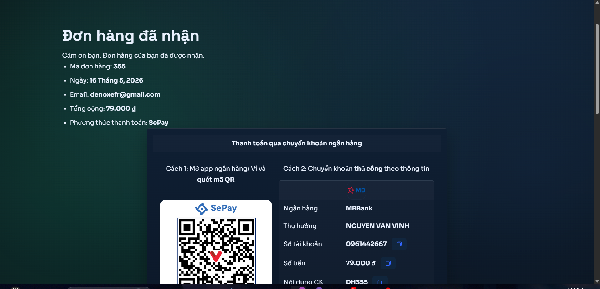
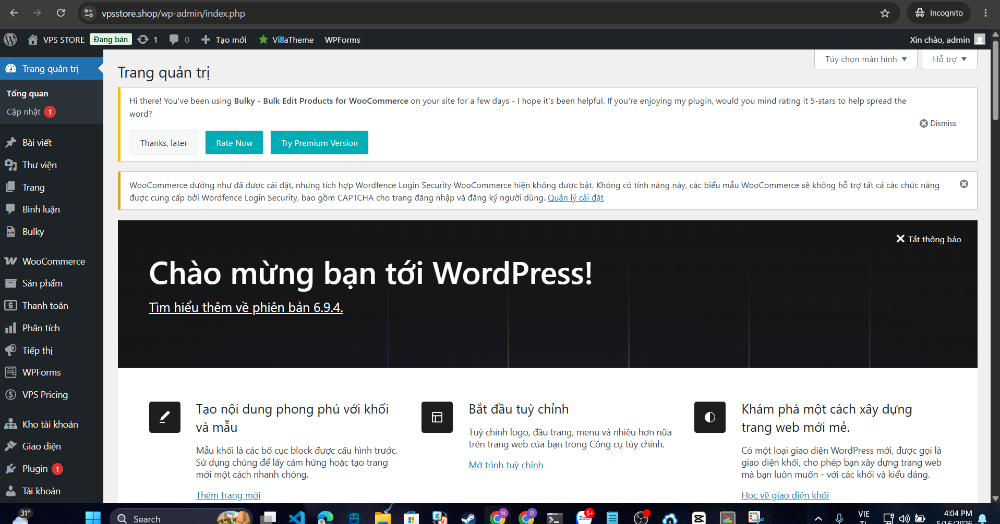

# VPS Store - Website Bán VPS/Hosting

## 1. Tên đề tài
Xây dựng và triển khai website bán hàng VPS/Hosting trên nền tảng WordPress + WooCommerce

---

## 2. Giới thiệu website/hệ thống
VPS Store là website thương mại điện tử chuyên cung cấp dịch vụ VPS, Hosting được xây dựng trên nền tảng WordPress kết hợp WooCommerce. Website được triển khai trên VPS Ubuntu với đầy đủ tính năng bán hàng online, thanh toán tự động qua SePay/VietQR và bảo mật SSL.

**Tính năng chính:**
- Bán hàng VPS/Hosting online
- Thanh toán SePay, VietQR
- Quản lý đơn hàng tự động
- Gửi email xác nhận đơn hàng
- Bảo mật SSL HTTPS
- Firewall UFW

---

## 3. Danh sách thành viên
| STT | Họ và tên |
|-----|-----------|
| 1 | Nguyễn Văn Vinh |
| 2 | Nguyễn Huy Hoàng | 
| 3 | Nguyễn Việt Dũng | 

---

## 4. MSSV từng thành viên
- Nguyễn Văn Vinh: 23810310047
- Nguyễn Huy Hoàng: 23810310064
- Nguyễn Việt Dũng: 23810310062

---

## 5. Phân công nhiệm vụ
| Thành viên | Nhiệm vụ |
|-----------|---------|
| Nguyễn Văn Vinh | Thiết kế và xây dựng giao diện website bán VPS; tạo danh mục sản phẩm, trang chủ, trang chi tiết sản phẩm, giỏ hàng và thanh toán trực tuyến bằng WooCommerce. |
| Nguyễn Huy Hoàng | Tìm hiểu công nghệ WordPress, XAMPP, PHP và MySQL; cài đặt môi trường phát triển website; xây dựng cơ sở dữ liệu và cấu hình hệ thống. |
| Nguyễn Việt Dũng | Viết báo cáo đề tài, tổng hợp nội dung, kiểm thử website, chỉnh sửa giao diện và hoàn thiện các chức năng của hệ thống trước khi nghiệm thu. |

---

## 6. Công nghệ sử dụng
| Thành phần | Công nghệ |
|-----------|-----------|
| Hệ điều hành | Ubuntu 24.04 |
| Web Server | Apache 2.4 |
| Ngôn ngữ | PHP 8.x |
| Database | MySQL 8.0 |
| CMS | WordPress 6.9.4 |
| Bán hàng | WooCommerce 10.7 |
| Thanh toán | SePay, VietQR |
| SSL | Let's Encrypt |
| Firewall | UFW |

---

## 7. Hướng dẫn cài đặt

### Yêu cầu hệ thống:
- VPS Ubuntu 22.04/24.04
- RAM tối thiểu 1GB
- Ổ cứng tối thiểu 10GB

### Cài LAMP Stack:
```bash
apt update && apt upgrade -y
apt install apache2 -y
apt install mysql-server -y
apt install php libapache2-mod-php php-mysql php-curl php-gd php-mbstring php-xml php-zip -y
```

### Tạo Database:
```bash
mysql -u root -p
```
```sql
CREATE DATABASE vps_store CHARACTER SET utf8mb4 COLLATE utf8mb4_unicode_ci;
CREATE USER 'wpuser'@'localhost' IDENTIFIED BY 'MatKhauManh123!';
GRANT ALL PRIVILEGES ON vps_store.* TO 'wpuser'@'localhost';
FLUSH PRIVILEGES;
EXIT;
```

### Import Database:
```bash
mysql -u root -p vps_store < /root/WEB/vps_store.sql
```

### Copy file WordPress:
```bash
mkdir -p /var/www/vps-store
cp -r /root/WEB/vps_full/vps-store/. /var/www/vps-store/
chown -R www-data:www-data /var/www/vps-store
chmod -R 755 /var/www/vps-store
```

---

## 8. Hướng dẫn chạy project

### Cấu hình wp-config.php:
```bash
nano /var/www/vps-store/wp-config.php
```
```php
define( 'DB_NAME', 'vps_store' );
define( 'DB_USER', 'wpuser' );
define( 'DB_PASSWORD', 'MatKhauManh123!' );
define( 'DB_HOST', 'localhost' );
define('WP_HOME', 'https://vpsstore.shop');
define('WP_SITEURL', 'https://vpsstore.shop');
```

### Cấu hình Virtual Host:
```bash
nano /etc/apache2/sites-available/vps-store.conf
```
```apache
<VirtualHost *:80>
    ServerName vpsstore.shop
    DocumentRoot /var/www/vps-store
    <Directory /var/www/vps-store>
        AllowOverride All
        Require all granted
    </Directory>
</VirtualHost>
```
```bash
a2ensite vps-store.conf
a2enmod rewrite
systemctl restart apache2
```

### Cài SSL:
```bash
apt install certbot python3-certbot-apache -y
certbot --apache -d vpsstore.shop -d www.vpsstore.shop
```

### Khởi động dịch vụ:
```bash
systemctl restart apache2
systemctl restart mysql
```

---

## 9. Tài khoản demo
| Vai trò | Username | Password |
|---------|----------|----------|
| Admin | admin | Gc^Cu6CT(scxeZbG |
| Customer | deno9099 | deno9099 |

---

## 10. Hình ảnh minh họa





---

## 11. Link video demo
[Xem video demo tại đây](https://youtube.com/...)

---

## 12. Link online đã deploy
- **Website:** https://vpsstore.shop
- **Admin:** https://vpsstore.shop/wp-admin
